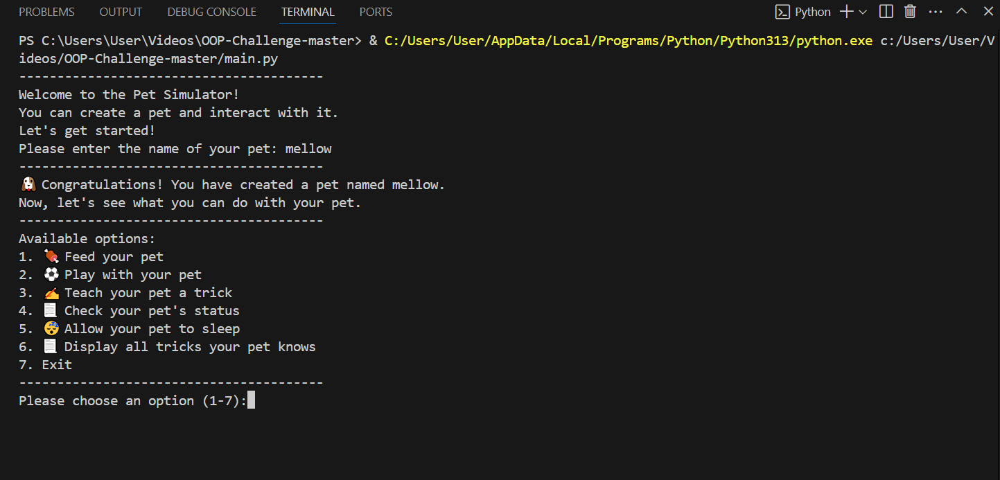
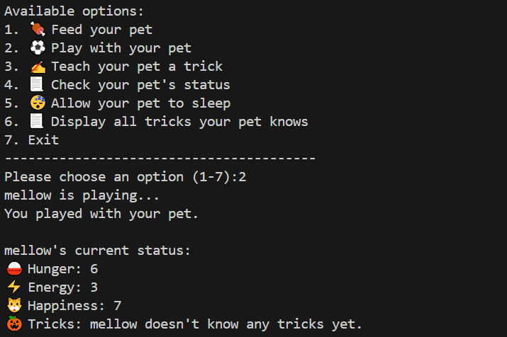
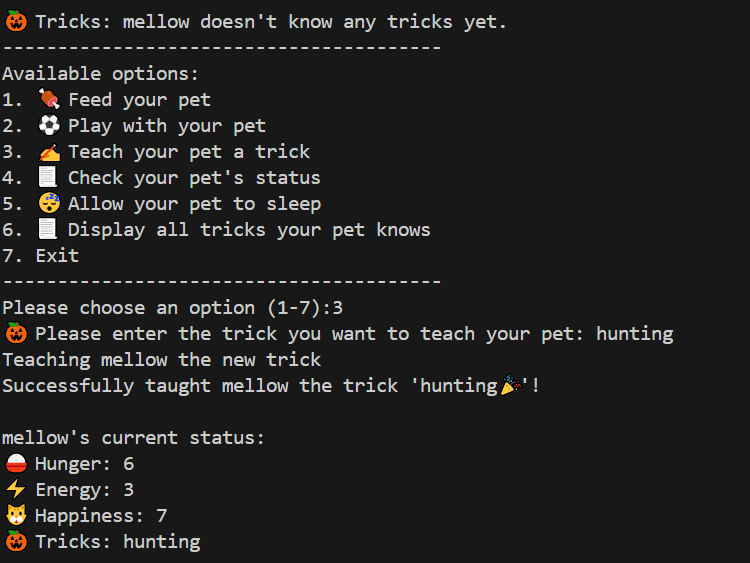

# 🐾 Pet Simulator – Group 135

Welcome to the **Pet Simulator**, a fun and interactive Python program that lets you create and care for your own virtual pet. This project was developed by **Group 135** as part of the PLP Academy OOP Challenge.

---

## 📌 Table of Contents

- [About the Project](#-about-the-project)
- [Features](#-features)
- [How to Use](#-how-to-use)
- [Screenshots](#-screenshots)
- [Technologies Used](#-technologies-used)
- [Authors and Contributors](#-authors-and-contributors)
- [Future Improvements](#-future-improvements)

---

## 🐶 About the Project

The **Pet Simulator** is a Python-based application designed to simulate the experience of owning and interacting with a virtual pet. It utilizes object-oriented programming (OOP) principles to create a `Pet` class with attributes and methods that allow users to perform various actions with their pet.

This project is beginner-friendly and demonstrates the use of:

- **Classes and objects**
- **Methods and attributes**
- **User input handling**
- **Loops and conditional statements**
- **Basic error handling**

---

## 🌟 Features

- 🐾 Create a Pet  
- 🍖 Feed Your Pet  
- 🧸 Play with Your Pet  
- 🧠 Teach Tricks  
- 📊 Check Status  
- 💤 Sleep Mode  
- 🎩 Show Tricks  
- 🚪 Exit Gracefully  

---

## 🚀 How to Use

1. **Clone the repository** to your local machine:

   ```bash
   git clone https://github.com/dav22-wa/OOP-Challenge.git
   
**Navigate to the project directory:**

cd OOP-Challenge

**Run the program:**


python main.py
Follow the on-screen instructions to interact with your pet.

## 📸 Screenshots
### 🏠 Main Menu  
This screenshot shows the main menu where users can choose different actions for their pet:



### ⚽ Playing with Your Pet  
This screenshot shows the pet being played with to increase its happiness:



### 🎭 Displaying Learned Tricks  
This screenshot shows the list of tricks your pet has learned so far:


### 📚 Teaching New Tricks  
This screenshot shows how to teach your pet new tricks to enhance its skill set:


## 🛠️ Technologies Used
Programming Language: Python

## Libraries:

time: Used for delays and animations.

## 👥 Authors and Contributors
This project was developed as part of the PLP Academy Group Assignment by Group 135. Below are the contributors:

Victoria Anazodo – ifunanyavictoria16@gmail.com

Sarah Wambui – wambuimchegez@gmail.com

Mutiat Bamidele – bintbamidele@gmail.com

Richelle Asmah – asmahrichelle9@gmail.com

Dancun Odhiambo – odhiambodancun144@gmail.com

Linah Ntinyari – linahntinyari9@gmail.com

David Waihenya – davidwaihenya254@gmail.com

Grace Akinyi – graceakinyi0074@gmail.com

Felix Oluoch – oroches254@gmail.com

Rashid Kisitu – kisiturashid01@gmail.com

## 🔮 Future Improvements
🖥️ Graphical User Interface (GUI): Introduce a visually appealing GUI for better interaction.

🧼 Additional Pet Actions: Add features like grooming or vet checkups.

🏆 Scoring System: Reward players for excellent pet care.

💾 Save and Load Feature: Allow users to save progress and continue later.
